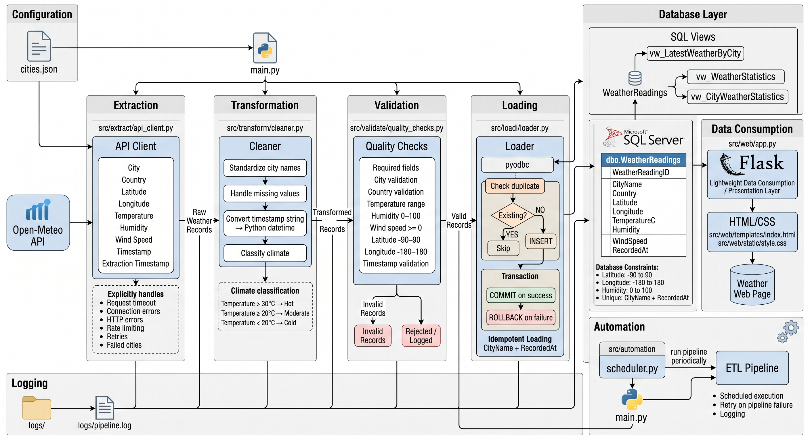

# 🌍 GlobalWeather Pipeline

### Automated Weather ETL Pipeline

A beginner-friendly Data Engineering project built to practice the core concepts of building an end-to-end ETL pipeline.
The project collects weather data from a public API, transforms and validates the data, loads it into Microsoft SQL Server, and provides simple SQL views and a lightweight Flask interface for data consumption.



* **Project Type:** Pure Data Engineering Training / Portfolio Project
* **Level:** Beginner Data Engineer
* **Focus:** ETL, Data Quality, SQL Server, Idempotent Loading, Automation

---

## 📌 Project Overview

The GlobalWeather Pipeline automates the process of collecting current weather data for multiple cities around the world.

The pipeline follows a simple ETL architecture:

```text
Cities Configuration
        │
        ▼
     Extract
        │
        ▼
    Transform
        │
        ▼
     Validate
        │
        ▼
       Load
        │
        ▼
   SQL Server
        │
        ▼
      Views
        │
        ▼
      Flask
```

The project intentionally uses a simple relational design with a single main weather table instead of a Star Schema, keeping the project focused on core Data Engineering concepts.

---

## 🎯 Project Goals

The main goals of this project are to practice:

* Building a Python-based ETL pipeline
* Working with public REST APIs
* Handling API responses
* Data transformation and standardization
* Data validation and quality checks
* Python-to-SQL Server connectivity
* Idempotent data loading
* Transaction handling and rollback
* Logging and error handling
* SQL views
* Basic pipeline automation
* Separating data processing stages
* Building a simple data consumption layer

---

## 🛠️ Tech Stack

| Technology               | Purpose                    |
| :----------------------- | :------------------------- |
| **Python**               | ETL pipeline               |
| **Requests**             | API communication          |
| **Pandas**               | Data processing foundation |
| **pyodbc**               | SQL Server connectivity    |
| **Microsoft SQL Server** | Data storage               |
| **T-SQL**                | Database objects and views |
| **python-dotenv**        | Environment configuration  |
| **Flask**                | Lightweight data display   |
| **HTML/CSS**             | Simple web interface       |
| **Git & GitHub**         | Version control            |

---

## 🔄 ETL Pipeline

### 1. Extract

The extraction stage communicates with the Open-Meteo API.
The pipeline reads cities and their coordinates from:

* `config/cities.json`

For each city, the API client retrieves:

* City information
* Latitude
* Longitude
* Temperature
* Humidity
* Wind speed
* Weather timestamp
* Extraction timestamp

The extractor also handles:

* HTTP errors
* Connection errors
* Request timeouts
* Rate limiting
* Retry attempts
* Failed cities
* API response validation

---

### 2. Transform

The transformation stage prepares the extracted data before validation and loading.
Current transformations include:

* Standardizing city names
* Handling missing values
* Converting the API timestamp string into a Python datetime
* Classifying temperature into climate categories

**Example:**

```text
" cairo "
      ↓
"Cairo"
```

**Timestamp:**

```text
"2026-09-25T02:00"
      ↓
Python datetime
```

**Climate classification:**

* `Temperature > 30°C` → Hot
* `Temperature ≥ 20°C` → Moderate
* `Temperature < 20°C` → Cold

---

### 3. Validate

The validation stage checks whether transformed records satisfy the project's data quality rules.

**Examples:**

* Required fields must exist
* City name must be valid
* Country must be valid
* Temperature must be within the accepted range
* Humidity must be between 0 and 100
* Wind speed cannot be negative
* Latitude must be between -90 and 90
* Longitude must be between -180 and 180
* Timestamp must exist

> **Note:** Invalid records are not sent to the loading stage.

---

### 4. Load

Valid records are loaded into Microsoft SQL Server using `pyodbc`.
The main table is:

* `dbo.WeatherReadings`

The loader implements:

* Database connection handling
* Duplicate detection
* Insert operations
* Transaction commit
* Transaction rollback
* Logging
* Database connection cleanup

The project uses:

```text
CityName + RecordedAt
```

as the logical duplicate check.
This allows the pipeline to behave in an idempotent way.

**Example:**

```text
First Run
100 records
      ↓
100 inserted

Second Run
100 same records
      ↓
100 skipped
```

---

## 🗄️ Database Design

The project intentionally uses a simple relational design.

### Main Table: `WeatherReadings`

Contains:

* `WeatherReadingID`
* `CityName`
* `Country`
* `Latitude`
* `Longitude`
* `TemperatureC`
* `Humidity`
* `WindSpeed`
* `RecordedAt`

The database also contains constraints for:

* Latitude
* Longitude
* Humidity
* Duplicate city/timestamp combinations

---

## 👁️ SQL Views

The project includes several SQL Server views:

* `vw_LatestWeatherByCity`: Returns the latest weather reading for each city.
* `vw_WeatherStatistics`: Provides overall weather statistics across all records.
* `vw_CityWeatherStatistics`: Provides aggregated statistics for each city.

These views provide a cleaner data-consumption layer without changing the underlying table.

---

## 🌐 Flask Web Layer

The project includes a lightweight Flask application.
Flask is not the main purpose of the project. It is only used as a simple data-consumption layer to display the latest weather readings retrieved from the SQL Server view:

* `vw_LatestWeatherByCity`

The flow is:

```text
SQL Server
    ↓
SQL View
    ↓
Flask
    ↓
HTML/CSS
```

No JavaScript frontend is required.

---

## ⏱️ Automation

The project includes a simple scheduler that can execute the pipeline periodically.
The scheduler supports:

* Scheduled execution
* Retry attempts
* Failure logging
* Delay between retries
* Repeated pipeline execution

The default interval is configurable.

---

## 📁 Project Structure

```text
GlobalWeather-Pipeline/
│
├── main.py
│
├── config/
│   ├── settings.py
│   └── cities.json
│
├── src/
│   ├── extract/
│   │   └── api_client.py
│   │
│   ├── transform/
│   │   └── cleaner.py
│   │
│   ├── validate/
│   │   └── quality_checks.py
│   │
│   ├── loadi/
│   │   └── loader.py
│   │
│   ├── automation/
│   │   └── scheduler.py
│   │
│   └── web/
│       ├── app.py
│       ├── templates/
│       │   └── index.html
│       └── static/
│           └── style.css
│
├── sql/
│   ├── create_database.sql
│   └── create_views.sql
│
├── .env
├── .env.example
├── .gitignore
├── requirements.txt
└── README.md
```

---

## ⚙️ Configuration

Environment-specific settings are stored in `.env`.
Sensitive or machine-specific configuration should not be committed to GitHub.

Example configuration:

```env
WEATHER_API_URL=https://api.open-meteo.com/v1/forecast

DB_SERVER=localhost\SQLEXPRESS
DB_NAME=GlobalWeatherDB
DB_DRIVER=ODBC Driver 17 for SQL Server
DB_TRUSTED_CONNECTION=yes

REQUEST_TIMEOUT=10
MAX_RETRIES=3
RETRY_DELAY=2
REQUEST_DELAY=0.1
```

---

## ▶️ Running the Pipeline

1. Install dependencies:

   ```bash
   pip install -r requirements.txt
   ```
2. Create the SQL Server database and table using:

   * `sql/create_database.sql`
3. Create the SQL views using:

   * `sql/create_views.sql`
4. Configure the `.env` file.
5. Then run:

   ```bash
   python main.py
   ```

---

## 📊 Example Pipeline Result

A successful run should produce logs similar to:

```text
Extraction completed. Successful: 100, Failed: 0

Transformation completed. Records transformed: 100

Validation completed. Valid: 100, Invalid: 0

Loading completed. Inserted: 100, Skipped: 0
```

Running the same data again should demonstrate idempotent behavior:

```text
Loading completed. Inserted: 0, Skipped: 100
```

---

## 🧠 Engineering Concepts Practiced

This project focuses on understanding practical Data Engineering concepts such as:

* ETL architecture
* Data contracts between pipeline stages
* API extraction
* Data cleaning
* Data type conversion
* Data validation
* Data quality rules
* Error handling
* Logging
* Retry logic
* Database transactions
* Rollback
* Idempotent loading
* Duplicate detection
* SQL constraints
* SQL views
* Configuration management
* Separation of responsibilities

---

## ⚠️ Project Scope

This project is intentionally designed as a small training and portfolio project.
It is not intended to represent a production-scale weather data platform.
The goal is to demonstrate understanding of fundamental Data Engineering concepts before moving to larger technologies such as:

* Apache Airflow
* Apache Kafka
* Apache Spark
* Docker
* Cloud platforms
* Distributed data processing
* Data warehouses

---

## 🚀 Future Improvements

Possible future improvements include:

* Apache Airflow orchestration
* Docker containerization
* Azure deployment
* More advanced monitoring
* Better retry/backoff strategies
* Historical weather storage
* More advanced data quality monitoring
* Larger-scale processing with Spark

These are intentionally outside the current scope of the project.

---

## 👨‍💻 Author

**Ahmed Ibrahim**
Computer and Data Science Student
Aspiring Junior Data Engineer

---

## 📌 Project Purpose

This project was built as a practical exercise to strengthen fundamental Data Engineering skills by building an end-to-end pipeline from API extraction to SQL Server storage and data consumption.
